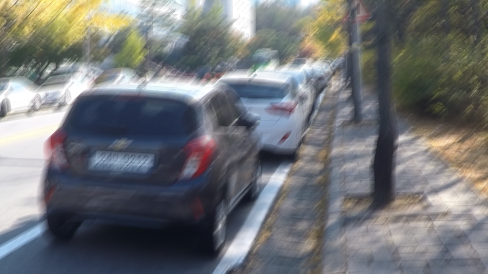
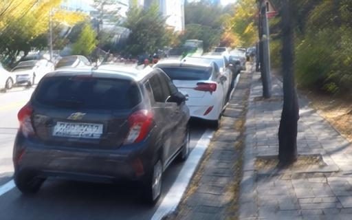
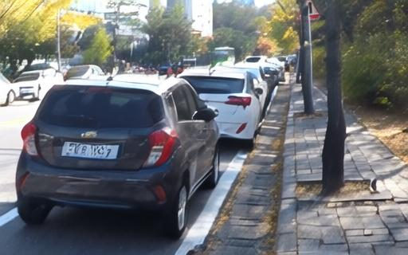
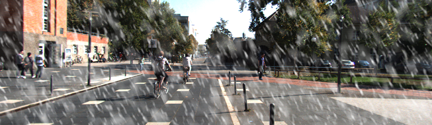
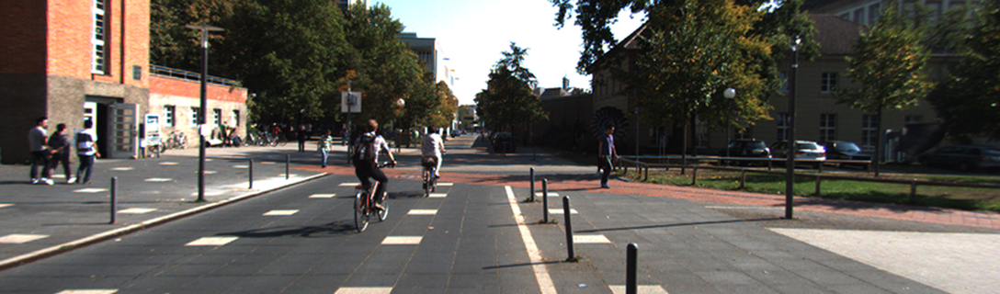
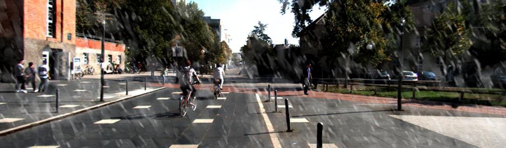
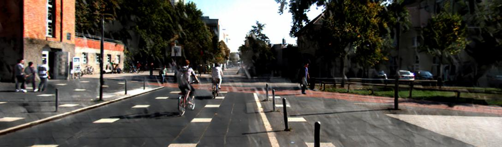

# 👆 DirectIR: Training-Free Enhancement for Diffusion-Based Image Restoration via Contrastive Guidance
***Image Processing 2024 Final Project***

Group 5: Group-SEVEN

[Youtube DEMO LINK](https://www.youtube.com/watch?v=Y2kIq410dEI&t=330s)

## Environment Setup

Follow the steps below to clone the repository, set up the environment, and install dependencies. The code is tested on **Python 3.10**.

```bash
git clone https://github.com/yeeecheng/directIR.git
cd directIR
conda create -n directIR python=3.10 -y
conda activate directIR
pip install -r requirements.txt
```

## Inference

To process the default image examples, run the following command. The pre-trained model weights will be automatically downloaded from Hugging Face and placed under the `checkpoints/` directory:

```bash
bash scripts/inference.sh
```
## Overall Pipeline
### Overview


### Textual Contrastive Loss


## Experimental Results
<table>
  <tr>
    <td></td>
    <td align="center">
      Degraded Image
    </td>
    <td align="center">
      Ground truth
    </td>
    <td align="center">
      PromptFix
    </td>
    <td align="center">
      PromptFix w/ Ours
    </td>
  </tr>
  <tr>
    <td rowspan="1" align="center">
      <b>Low-Light</b>
    </td>
    <td align="center">
      
    </td>
    <td align="center">
      
    </td>
    <td align="center">
      
    </td>
    <td align="center">
      
    </td>
  </tr>
  <tr>
    <td rowspan="1" align="center">
      <b>Motion-Blur</b>
    </td>
    <td align="center">
      
    </td>
    <td align="center">
      
    </td>
    <td align="center">
      
    </td>
    <td align="center">
      
    </td>
  </tr>
  <tr>
    <td rowspan="1" align="center">
      <b>Snow</b>
    </td>
    <td align="center">
      
    </td>
    <td align="center">
      
    </td>
    <td align="center">
      
    </td>
    <td align="center">
      
    </td>
  </tr>
</table>

## 🙏 Acknowledgments

We would like to thank the authors of [Promptfix](https://github.com/yeates/PromptFix), [InstructDiffusion](https://github.com/cientgu/InstructDiffusion), [Stable Diffusion](https://github.com/CompVis/stable-diffusion), and [InstructPix2Pix](https://github.com/timothybrooks/instruct-pix2pix) for sharing their codes.
